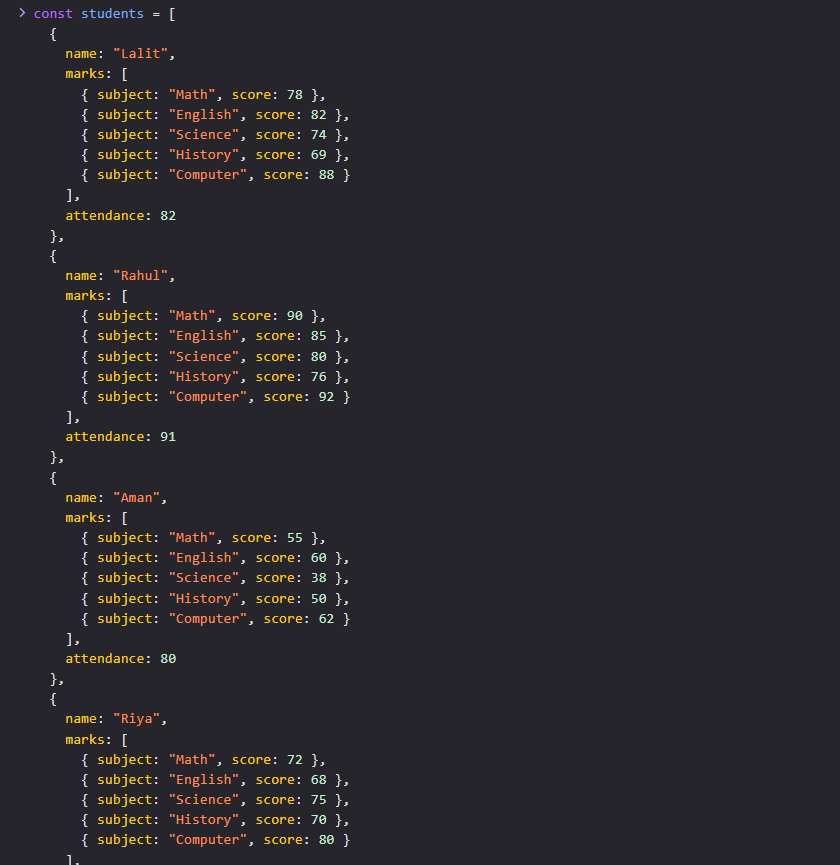
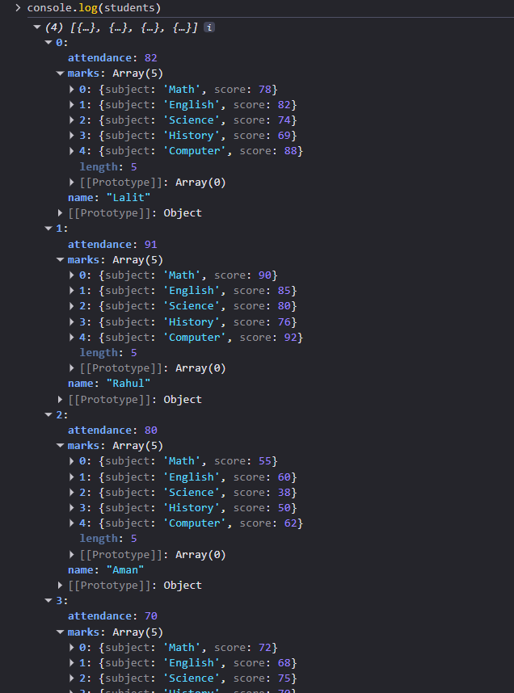
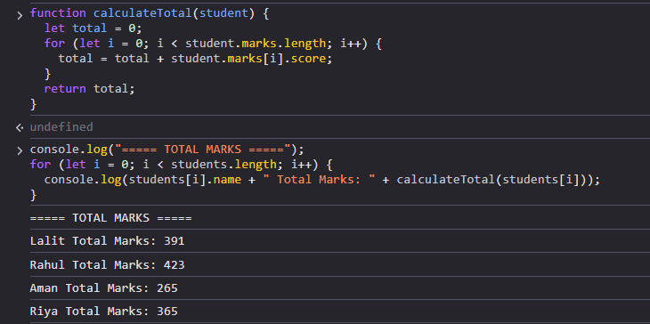
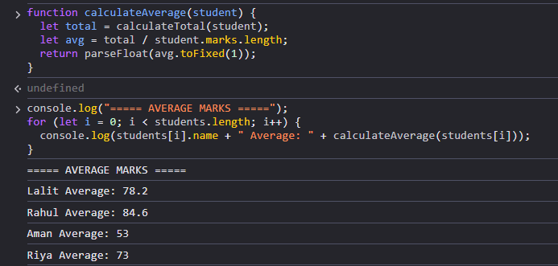
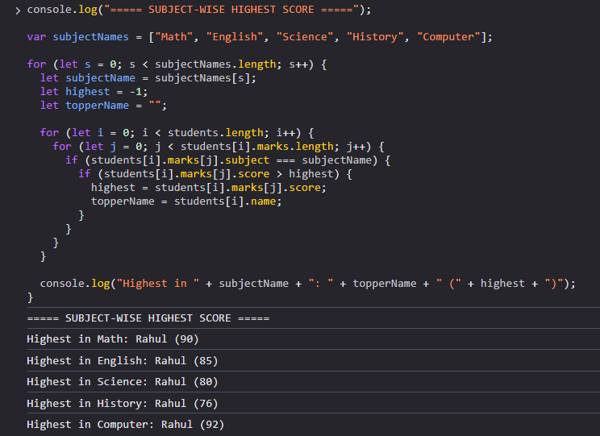
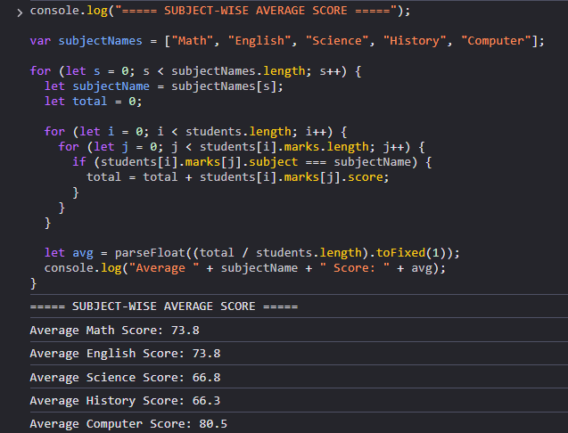
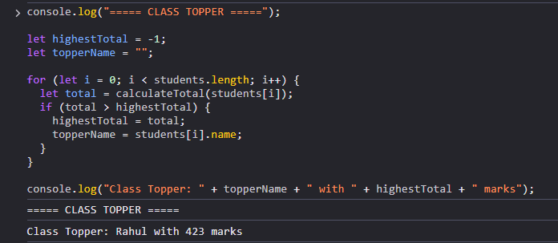
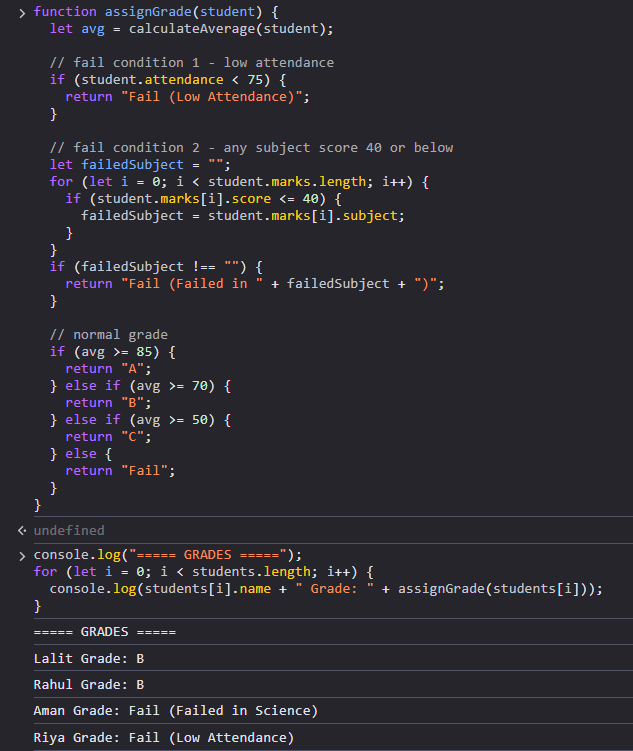
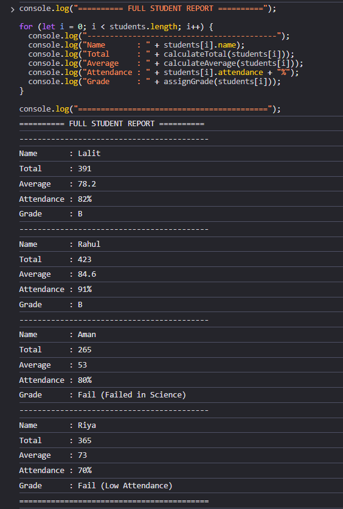

# Student Performance Analyzer

A console-based JavaScript program that analyzes student performance.
Built during JavaScript Fundamentals Training at NucleusTeq.

---

## What this program does

- Calculates total and average marks for each student
- Finds highest scorer and average score for each subject
- Declares the class topper
- Assigns grades and handles fail conditions
- Everything is printed using console.log() — no DOM used

---

### 1 – Student Data Structure

This is the students array I created. Each student has a name, marks in 5 subjects,
and an attendance value. I used objects so that all info about one student stays together.

---

### 2 – Verifying Data in Console

I logged the students array just to double check that all 4 students and their
data were stored correctly before starting any calculations.

---

### 3 – Total Marks

This shows the calculateTotal function and its output. I used a for loop to add
up all subject scores for each student.

- Lalit: 391 | Rahul: 423 | Aman: 265 | Riya: 365

---

### 4 – Average Marks

This shows the calculateAverage function. It reuses calculateTotal and divides
by 5 (number of subjects). Used toFixed(1) to get one decimal place.

- Lalit: 78.2 | Rahul: 84.6 | Aman: 53 | Riya: 73

---

### 5 – Subject-wise Highest Score

For each subject, I looped through all students and compared scores to find
who scored the highest. Rahul scored highest in all 5 subjects.

---

### 6 – Subject-wise Average Score

For each subject, I added up all students scores and divided by 4.

- Math: 73.8 | English: 73.8 | Science: 66.8 | History: 66.3 | Computer: 80.5

---

### 7 – Class Topper

I compared total marks of all students and whoever had the highest total
was declared the topper.

- Class Topper: Rahul with 423 marks

---

### 8 – Grades with Fail Conditions

The assignGrade function checks two fail conditions first — low attendance
(below 75%) and any subject score 40 or below. If neither triggers, grade
is based on average marks.

- Lalit: B | Rahul: B | Aman: Fail (Failed in Science) | Riya: Fail (Low Attendance)

---

### 9 – Full Student Report

This is the final output that combines everything — name, total, average,
attendance, and grade for all 4 students printed together in one place.
