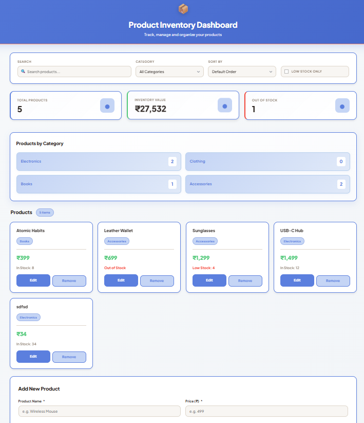
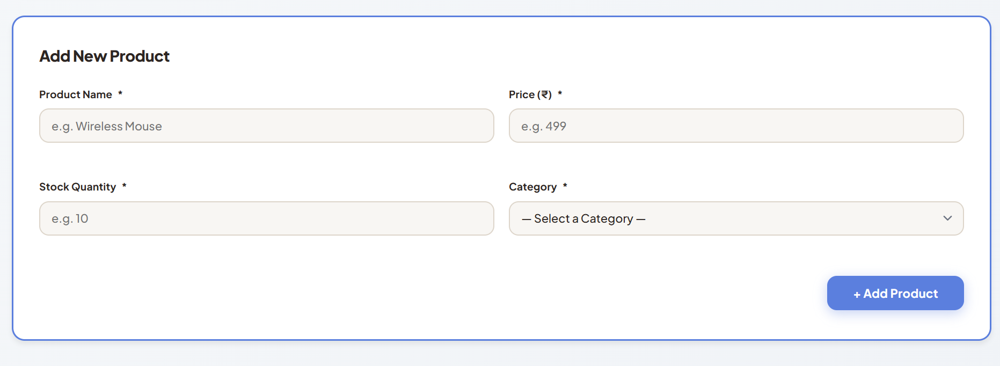
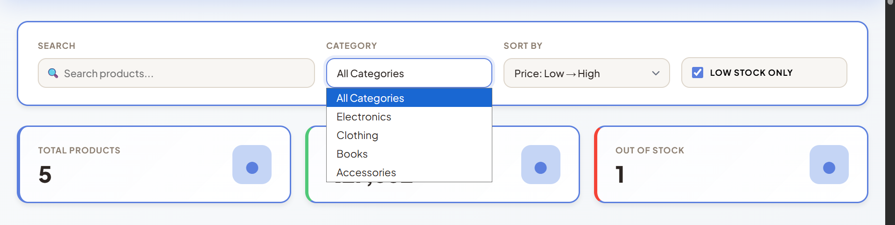
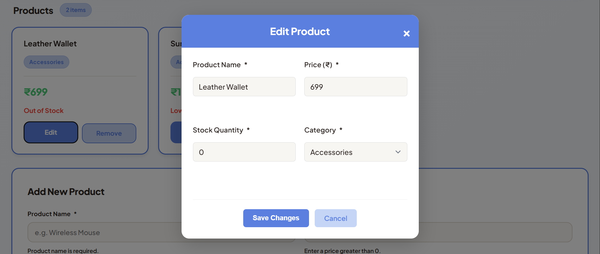
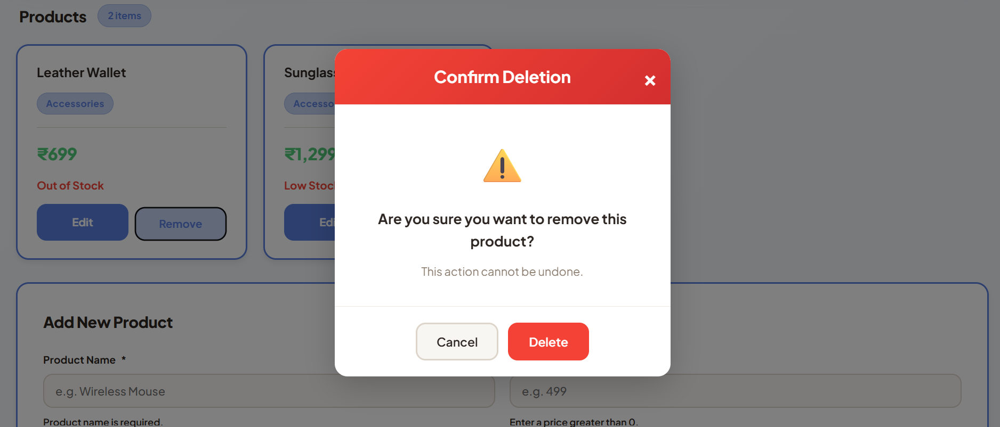
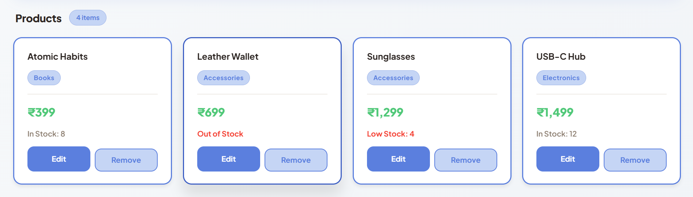
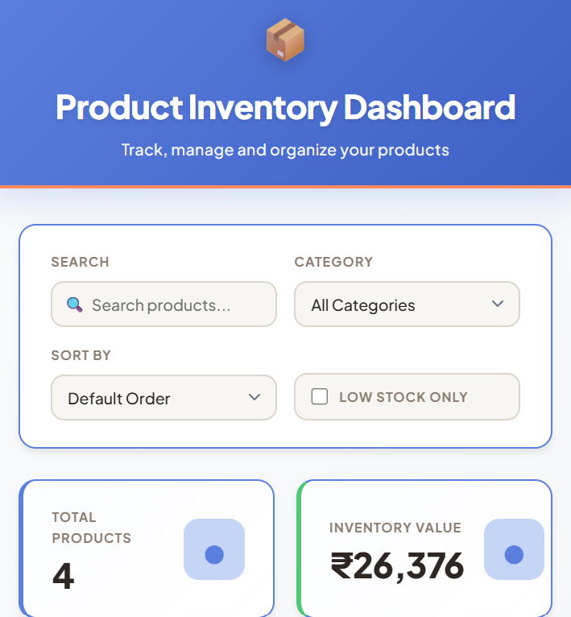
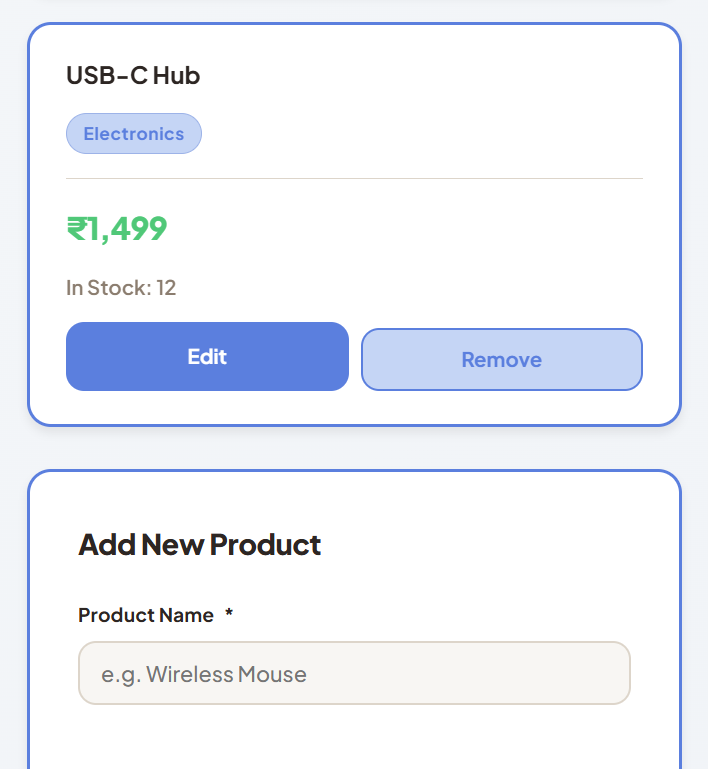

# Product Inventory Dashboard

A modern, fully-functional inventory management system built with vanilla HTML, CSS, and JavaScript. Manage your product catalog with real-time search, filtering, sorting, and analytics.

## Features

- **Dynamic Product Management** - Add, edit, and remove products with real-time updates
- **Advanced Search** - Case-insensitive product name search with instant results
- **Smart Filtering** - Filter by product category or show only low-stock items
- **Flexible Sorting** - Sort by price (low to high, high to low) or alphabetically (A-Z, Z-A)
- **Category Distribution** - Visual breakdown of products per category
- **Analytics Dashboard** - Track total products, inventory value, and out-of-stock items
- **Automatic Pagination** - Browse products 6 per page with intuitive navigation
- **Data Persistence** - All changes automatically saved to browser's localStorage
- **Edit Modal** - Click any product to update name, price, stock, or category
- **Delete Confirmation** - Prevent accidental deletions with a confirmation popup
- **Responsive Design** - Optimized for desktop, tablet, and mobile devices
- **Loading States** - Visual feedback during simulated API calls
- **Empty States** - Helpful messages when no products match current filters
- **Category Badges** - Color-coded visual indicators for each product category

##  Screenshots

### Dashboard Overview

Full view of the product inventory dashboard showing products grid, analytics cards, and filter controls.

### Add New Product

Form interface for adding new products with validation for all fields.

### Search & Filter in Action

Real-time search and filtering by category or low-stock status.

### Edit Product Modal

Edit modal showing how to update product details with inline validation.

### Delete Confirmation

Confirmation popup that prevents accidental product deletion.

### Product Cards Display

Product cards showing all inventory items with name, category badge, price, stock status, and edit/delete buttons for each product.

### Mobile Responsive View


Dashboard displayed on mobile devices with full functionality.

##  How to Run

1. Navigate to the `product_inventory_dashboard` folder
2. Open `index.html` in any modern web browser (Chrome, Firefox, Safari, Edge)
3. That's it! The app loads with sample products and is ready to use

No installation, no dependencies, no build process needed.

##  Project Structure

```
product_inventory_dashboard/
├── index.html(Main HTML markup with all UI components)
├── README.md (Project documentation and setup guide)
├── style.css (Complete styling system with responsive design)
├── script.js (Application logic, event handling)
└── screenshots/
    ├── 01-dashboard-overview.png
    ├── 02-add-product-form.png
    ├── 03-search-filter.png
    ├── 04-edit-product-modal.png
    ├── 05-delete-confirmation.png
    ├── 06-product-cards.png
    └── 07-mobile-responsive.png
```

##  Data Storage

All product data is saved automatically to your browser's localStorage. This means:
- Changes persist even after closing the browser
- Each browser/device maintains its own product list
- Clear your browser cache/storage to reset to default products

##  Sample Data

The app comes pre-loaded with 10 sample products across 4 categories:
- **Electronics** (Laptop, Mouse, Speaker, USB Hub)
- **Clothing** (T-Shirt, Jacket)
- **Books** (The Alchemist, Atomic Habits)
- **Accessories** (Wallet, Sunglasses)

##  Technical Details

**Technologies Used:**
- HTML5 for semantic markup
- CSS3 with custom design tokens and animations
- Vanilla JavaScript (ES6+) with no external dependencies
- localStorage API for data persistence
- Promise + setTimeout for simulated async operations

**Browser Support:**
- Chrome (latest)
- Firefox (latest)
- Safari (latest)
- Edge (latest)

##  License

This project is created for educational purposes as part of an inventory management assignment.
